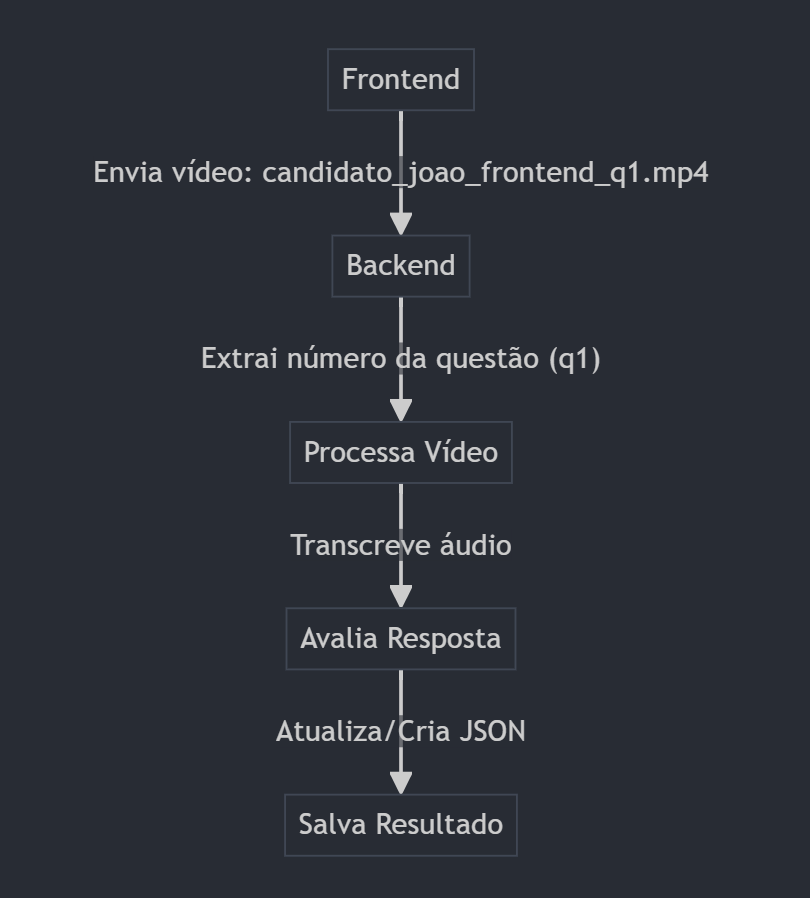

# POC - Sistema de Avaliação Automatizada de Entrevistas em Vídeo

Aplicação Python que automatiza todo o processo de avaliação de entrevistas técnicas em vídeo: da extração de áudio até a pontuação das respostas com IA.

## Funcionalidades

- Extração de áudio de vídeos via FFmpeg
- Transcrição de áudio com Whisper, com detecção automática de idioma
- Captura opcional de frames do vídeo
- Resumo das respostas com LLM (Groq API)
- Avaliação técnica automatizada (pontuação 0-10 e feedback) comparando resposta do candidato com gabarito
- Relatórios JSON por candidato e pergunta

## Melhorias Recentes

- Adicionado sistema de avaliação técnica automatizada com pontuação e feedback detalhado
- Refatoração para arquitetura modular, com testes unitários e suporte multiplataforma

## Configuração do Ambiente

1. Crie um ambiente virtual:
```bash
python -m venv venv
```

2. Ative o ambiente virtual:
```bash
# Windows
.\venv\Scripts\activate

# Linux/Mac
source venv/bin/activate
```

3. Instale as dependências:
```bash
pip install -r requirements.txt
```

## Estrutura do Projeto

```
.
├── input/              # Pasta para arquivos de vídeo de entrada
├── output/             # Pasta para transcrições, áudio extraído e frames
├── src/                # Código principal (main.py)
├── transcription/      # Módulos de transcrição, resumo e Groq API
├── tests/              # Testes unitários
├── config.py           # Configurações globais (ex: diretórios, modelo)
├── requirements.txt    # Dependências do projeto
└── README.md           # Este arquivo
```

## Como Usar

1. Coloque seu arquivo de vídeo na pasta `input/`
2. Execute o script principal:
```bash
python src/main.py
```
3. A transcrição e o resumo serão salvos automaticamente na pasta `output/`

## Desenvolvimento

Para executar os testes:
```bash
pytest tests/
```

### Fluxo de Processamento



